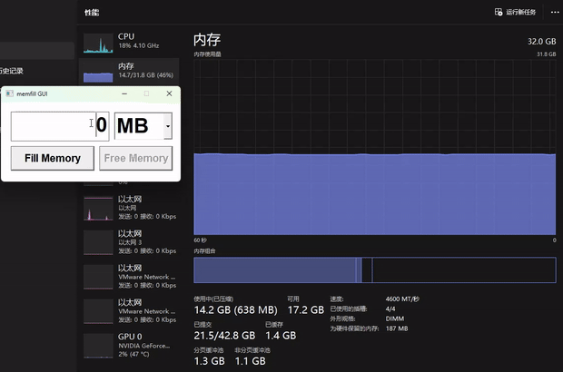

# memfill

Simple memory filling utility for Windows.

memfill: console executable
memfill_GUI: GUI executable

## Build

#### MSVC:

1. Go to Developer Command Prompt for VS or Developer PowerShell for VS
2. run build_MSVC.bat

#### MinGW:

1. run build_MinGW.bat

## Additional
1. Due to the Windows virtual memory mechanism, the filled physical memory may be paged out to virtual memory after a period of time

2. It is strongly recommended not to allocate more memory than the total size of the virtual memory, as this may cause errors